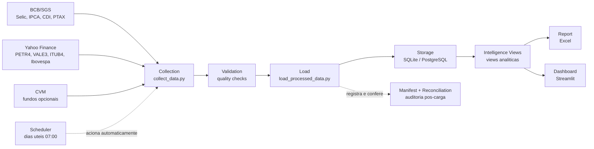

# Brazilian Financial Data Pipeline


Pipeline executivo para coleta, validação, armazenamento, reconciliação e reporte de dados financeiros brasileiros.

## Documentação

- [Visão de produto para recrutadores e gestores](docs/product.md)
- [Arquitetura do pipeline com diagrama](docs/architecture.md)
- [Cobertura de testes](docs/TEST_COVERAGE.md)
- [Documentação da API REST](docs/API.md)
- [Deploy reproduzível com Docker](docs/DEPLOYMENT.md)

## Problema

Dados financeiros brasileiros relevantes para análise de mercado ficam espalhados em fontes diferentes, com calendários de publicação distintos, falhas temporárias e formatos inconsistentes. Analistas de dados e times financeiros precisam consolidar Selic, IPCA, CDI, PTAX e ativos da B3 com rastreabilidade suficiente para tomada de decisão, auditoria e comunicação executiva.

## Solução

O pipeline automatiza o fluxo de ponta a ponta: coleta dados públicos, valida qualidade, armazena em SQLite normalizado, mede cobertura histórica, gera alertas, reconcilia artefatos e entrega um relatório Excel pronto para consumo.

Arquitetura resumida: coleta → validação → armazenamento → relatório.



## Resultados Reais

Backfill validado: `2024-01-01` a `2026-06-28`.

| Métrica | Resultado |
|---|---:|
| `selic_daily` | 625 registros |
| `ipca_monthly` | 29 registros |
| `usd_brl_ptax_sell_daily` | 625 registros |
| `cdi_daily` | 624 registros |
| Ações B3 | 2484 registros |
| `fact_bcb_series` | 1903 registros |
| `fact_b3_stock_prices` | 2484 registros |
| Cobertura | 8 datasets, 99.56% média, `overall_status: OK` |
| Reconciliação | `PASSED` |
| Validação | 47 checks, 44 PASS, 2 WARN, 0 FAIL |

## Arquitetura

| Módulo | Nome | Descrição | Arquivo principal |
|---:|---|---|---|
| 1 | Coleta | BCB/SGS, yfinance, PTAX | `src/collect_data.py` |
| 2 | Validação | 47 checagens SQL + Python | `src/validate_data.py` |
| 3 | Armazenamento | SQLite normalizado, views analíticas | `src/load_processed_data.py` |
| 4 | Relatório | Excel automático com gráficos | `src/generate_report.py` |

Componentes complementares:

- Scheduler operacional com APScheduler: `src/scheduler.py`
- Cobertura histórica: `src/coverage_report.py`
- Alertas operacionais: `src/alerts.py`
- Manifest e lineage: `src/metadata/`
- Reconciliação pós-execução: `src/validation/reconciliation.py`

## Fontes de Dados

- BCB/SGS: Selic, série 11; IPCA, série 433; CDI, série 12; PTAX USD/BRL
- Yahoo Finance: `PETR4.SA`, `VALE3.SA`, `ITUB4.SA`, `^BVSP`
- CVM: opcional via `--include-cvm`

## Stack

Python 3.12, pandas, requests, yfinance, SQLite, openpyxl, APScheduler.

## Como Rodar

Clone o repositório:

```powershell
git clone https://github.com/PedroPaullo/brazilian-financial-data-pipeline.git
```

Entre na pasta:

```powershell
cd brazilian-financial-data-pipeline
```

Crie o ambiente virtual:

```powershell
python -m venv .venv
```

Ative o ambiente virtual:

```powershell
.\.venv\Scripts\Activate.ps1
```

Instale as dependências:

```powershell
pip install -r requirements.txt
```

Execute o backfill completo:

```powershell
python .\collect_data.py --start-date 2024-01-01 --end-date 2026-06-28
```

Execute validação, carga, cobertura, relatório, alertas, manifest e reconciliação:

```powershell
python .\run_pipeline.py --skip-collection --enable-manifest --reconcile
```

Execute uma rotina diária manual:

```powershell
python .\run_pipeline.py --start 2024-01-01 --end 2026-06-28 --enable-manifest --reconcile
```

Inicie o scheduler operacional:

```powershell
python .\src\scheduler.py
```

Teste uma execução imediata do scheduler:

```powershell
python .\src\scheduler.py --run-now
```

## API REST

O projeto também expõe a camada de inteligência financeira por uma API REST com FastAPI.

Inicie a API localmente:

```powershell
uvicorn src.api:app --reload
```

A documentação interativa fica disponível em:

```text
http://127.0.0.1:8000/docs
```

Principais endpoints:

- `GET /health`
- `GET /indicators/latest`
- `GET /assets/returns`
- `GET /data/freshness`
- `GET /pipeline/health`
- `GET /sources/availability`
- `GET /indicators/macro/monthly`

## Diferenciais

- Controle `NOT_YET_AVAILABLE`: o pipeline não trata dado ausente como sucesso quando a fonte ainda não publicou a série.
- Política de retenção de artefatos: estrutura `latest`, `daily` e `runs` para rastreabilidade sem poluir o Git.
- Reconciliação completa após cada execução com status `PASSED`, `WARNING` ou `FAILED`.
- Logging estruturado no terminal e em `logs/pipeline.log`.
- Agendamento automático em dias úteis às 07:00 no fuso `America/Sao_Paulo`.

## Autor

Pedro Paulo, Engenharia de Controle e Automação.

- LinkedIn: https://linkedin.com/in/pedropaullosazevedo
- GitHub: https://github.com/PedroPaullo
