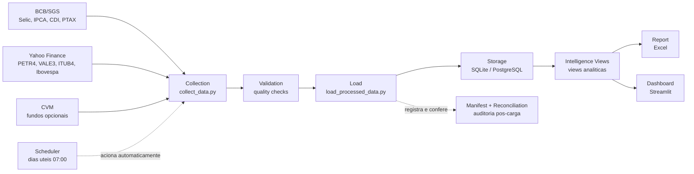

# Arquitetura do Pipeline

Este documento resume o fluxo operacional do Brazilian Financial Data Pipeline para avaliadores tecnicos e nao tecnicos.

## Fluxo de dados

## Etapas

### Fontes de dados

O pipeline consolida informacoes de fontes publicas relevantes para o mercado financeiro brasileiro. As fontes principais sao BCB/SGS para indicadores macroeconomicos, Yahoo Finance para ativos da B3 e CVM para dados institucionais opcionais.

Cada fonte tem calendario e comportamento proprio. Por isso, a solucao trata disponibilidade esperada, atrasos de publicacao e ausencia temporaria sem confundir falha operacional com dado ainda nao publicado.

### Coleta

A etapa de coleta baixa os dados brutos no periodo solicitado e grava os arquivos de entrada em estrutura local. Ela preserva o dado como veio da fonte para permitir auditoria posterior.

O scheduler pode acionar a coleta automaticamente em dias uteis as 07:00 no fuso `America/Sao_Paulo`. Tambem e possivel executar backfills historicos manualmente por linha de comando.

### Validacao

A validacao confere se os dados coletados possuem formato, datas, valores e consistencia minima para seguirem no pipeline. Ela identifica problemas como arquivos vazios, duplicidades, valores invalidos e inconsistencias de OHLC em cotacoes.

O objetivo nao e apenas falhar rapido, mas registrar evidencias claras. Quando uma serie ainda nao deveria estar disponivel, a validacao aponta `WARNING` estruturado em vez de tratar ausencia como sucesso.

### Armazenamento

Os dados aprovados sao carregados em um modelo relacional normalizado, com SQLite como backend padrao local. O projeto tambem possui suporte a PostgreSQL para validacao em ambiente de CI ou producao.

Esse armazenamento separa dimensoes, fatos e views analiticas. Assim, os consumidores acessam dados consistentes sem depender diretamente dos CSVs brutos.

### Views de inteligencia

A camada de inteligencia cria respostas analiticas prontas, como indicadores mais recentes, ranking de retornos, freshness das fontes e resumo macro mensal. Ela transforma tabelas transacionais em visoes uteis para analise executiva.

Essa camada tambem reduz repeticao no dashboard e nos relatorios. Em vez de cada tela recalcular tudo do zero, as perguntas principais ja ficam modeladas no banco.

### Relatorio e dashboard

O relatorio Excel entrega uma versao distribuivel do resultado, com abas de indicadores, benchmarks, cobertura, performance e reconciliacao. Ele e util para envio, reunioes e registro de execucoes.

O dashboard Streamlit entrega exploracao interativa para consulta diaria. Nele, o usuario pode navegar por resumo executivo, Selic, IPCA, cotacoes B3 e inteligencia financeira.

### Manifest, reconciliacao e auditoria

Apos a carga, o pipeline registra manifest, checksums, versoes de datasets e status de reconciliacao. Isso permite responder o que foi executado, com quais entradas, quais saidas foram geradas e se os totais batem.

Essa trilha diferencia o projeto de um script isolado. O resultado final e uma rotina operacional auditavel, com evidencias para investigacao e melhoria continua.

## Politica de retencao de artefatos

Os artefatos operacionais seguem a estrutura `latest`, `daily` e `runs`.

- `latest`: sempre aponta para a execucao mais recente e facilita consumo por dashboards, relatorios e validacoes.
- `daily`: mantem um consolidado por dia, evitando multiplas copias desnecessarias em execucoes repetidas.
- `runs`: guarda execucoes individuais quando o modo de arquivamento detalhado e habilitado.

Essa politica equilibra rastreabilidade e limpeza do repositorio. O pipeline preserva evidencia suficiente sem transformar cada execucao em acumulo permanente de arquivos.

## Disponibilidade esperada e freshness

Nem toda ausencia de dado significa erro. Algumas series seguem calendario de publicacao especifico e podem estar indisponiveis quando o periodo solicitado inclui datas recentes.

O exemplo real e o `ipca_monthly`, serie BCB SGS 433. Como o IPCA e mensal e possui atraso de publicacao, um periodo recente pode retornar `NOT_YET_AVAILABLE` com severidade `WARNING`; nesse caso o pipeline nao gera dado falso, nao reaproveita CSV antigo e nao trata a ausencia como sucesso.

Para series diarias obrigatorias, como Selic, CDI e PTAX, a ausencia em periodo ja esperado vira alerta ou erro conforme a regra de tolerancia. A reconciliacao reflete esse status para que a operacao saiba se houve falha real, dado ainda nao publicado ou fonte pulada por configuracao.
